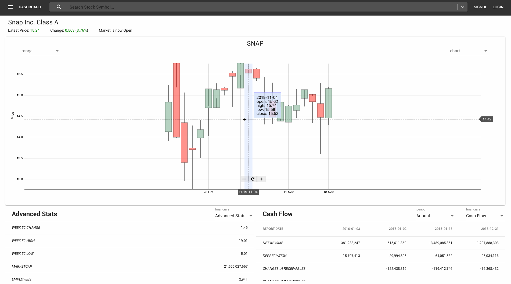

# Online Trading Platform
## Purpose
* This is my 1st big project to develop a full stack app by myself.
* It will be an online trading platform mainly for equities.
* Charts visualization and creation of personal portfolios will be the first end goal.
* Implement machine learning to analyze stocks will be my 2nd end goal, this will be done in the near future when I have the time.

## Demo
* This app uses 2 heroku servers, 1 for the frontend, and another for the backend.
  * Therefore, if may take a while to load the page or for the user registration / sign in.

* Feel free to try out the demo
  > https://onlinetradingplatform.herokuapp.com/
* Creating an account will be required to test the trading feature and modify account settings.
  * Disclaimer, accounts will be deleted without prior notice as this project is still in the development stage.

## How to make this work
* Get your own Django secret key
  * Create your own Django app => copy the secret key => paste into this project's secret key location at settings.py or in your environment.
      ```python
      # Use python 3 to generate your own Django secret key
      import secrets
      print(secrets.token_hex(24))
      ```
* ~~Create your own mysql database~~
  * ~~Change the username, password, and database name at settings.py~~
* API key is required if you want to use data from IEX cloud.
  * Create free account with IEX at https://iexcloud.io/.
  * Real data is free data but limited. However, simulated data is completely free.
    * If using simulated data, paste the following with the api key in the environment
      > export REACT_APP_iexToken="api_key"
* API key is required to get real news feed from news api
  * Create account for free at https://newsapi.org/
    > export REACT_APP_newsAPI="api_key"
* Add local server address to environment or manually edit in the utility.js file
  > export REACT_APP_DB="http://127.0.0.1:8000"
* Company profile data is taken from https://financialmodelingprep.com
  * no additional settings required
* Use pipenv to install all python dependencies for the backend.
* Use npm to install all frontend related dependencies.

## How to run
1. ~~Run MySql server~~ Postgres is used in the production side
2. Run backend server
    * python manage.py runserver
3. Run Frontend server
    * npm start

## List of major technologies used
* Django
* React
* D3
* ~~MySql~~ changed to sqlite for development, and Postgres for production
* Django Rest Framework
* Redux
* Material-UI

## List of Things to do
* ~~Build a restful api with Django~~
* ~~Start a simple template with React~~
* ~~Use MySql as database~~
* ~~Integrate MySql with Django~~
* ~~Integrate React with Django~~
* ~~Made a basic user authentication feature~~
* ~~Style with Material-UI~~
* ~~Integrate d3 with React~~
* ~~Write my own iex api to get financial data from IEX~~
* ~~Integrate iex api with d3~~
* ~~Write my own iex cloud api to get financial market and stocks data from IEX cloud~~
* ~~Integrate iex cloud api with d3~~
* ~~Slightly improved d3 charts~~
* ~~Reorganize Navbar into separate components~~
* ~~Implement Search Bar and enable multi search feature~~
* ~~Implement Async Select and Search in large database~~
* ~~Link Nav search bar with chart display~~
* ~~Add range select for chart~~
* ~~Implement Candle Stick chart~~
* ~~Fix X ticks~~
* ~~Implement Menu bar~~
* ~~Add news to Dashboard~~
* ~~Add Company Profile to Dashboard~~
* ~~Add Advanced Stats to Dashboard~~
* ~~Add Key Stats, Balance Sheet, Cash Flow, Income Statement to Dashboard~~
* ~~Add other features and links into Menu (news, etc.)~~
* ~~Reorganize Dashboard and split into different pages~~
* ~~Add Loading feature~~
* ~~Add portfolio frontend and backend feature~~
* ~~Add buy and sell stock feature~~
* ~~Improve trade UI~~
* ~~Add real time price update for trade UI~~
* ~~Add real time price and change update for Dashboard UI~~
* ~~Add Profile feature~~
* ~~Add privacy for portfolio and profile~~
* ~~Add token expiry feature (auto logout or extend) in backend and frontend~~
* ~~Add auto fund update for trade UI~~
* ~~Add transaction history at backend~~
* ~~Add manual fund input feature~~
* ~~Improve profile feature~~
* ~~Add username update feature~~
* ~~Add email update feature~~
* ~~Add password update feature~~
* ~~Add error handling for user profile update feature~~
* ~~Refactor code for reuse and reduce code redundancy~~
* ~~Implement real news feed~~
* ~~Implement real company profile details~~
* ~~Implement chart select feature~~
* ~~Improve d3 visualization~~
* ~~Expand the type of graphs and visualizations with d3~~
* ~~Add loading UI~~
* ~~Add last 4 annually and quarterly financial reports~~
* ~~Fix number and word formats in financial reports~~
* ~~Add password reset feature~~
* ~~Add Tooltip~~
* ~~Add Icons~~
* ~~Add Real time chart support~~
* Add multi symbol support on a single chart
* Improve auto logout alert UI
* Improve overall styling
